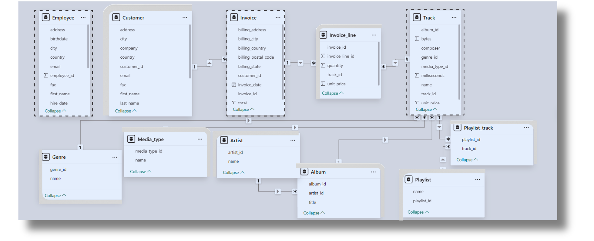

# Music_Store_Analysis
🎵 **Online Music Store Analysis with SQL** 

📌 **OVEVIEW**
This project focuses on analyzing data from an online music store using SQL. The goal is to explore and understand business growth by answering practical questions related to sales, customers, and genre performance.

🎯 **OBJECTIVES**
Identify the most popular music genres by country

Determine top-spending customers across regions

Analyze purchasing trends and behavior

Support business decisions with data-backed insights

🧰 **TOOLS & TECHNOLOGIES**
SQL (SQL Server Management Studio)
Power BI for Schema model
Relational Database containing tables like customer, invoice, track, genre, and invoice_line

📈 **WHAT YOU'LL FIND**
The project includes a series of SQL queries that answer questions such as:

Which countries have the most Invoices?

Who is the best customer? The customer who has spent the most money will be declared the best customer. 

Return all the track names that have a song length longer than the average song length. Return the Name and Milliseconds for each track. Order by the song length with the longest songs listed first.

📂 **DATASET**
The dataset is sourced from a fictional online music store and contains information on customer purchases, music tracks, genres, and invoice history.

🔍 **HOW TO USE**
Clone this repository

Open the SQL file in SQL SSMS

Run queries step by step to see insights

Modify or add queries for further exploration

📎 **PROJECT LINK**
Feel free to explore the project and give feedback!
[Music_Store_Analysis](https://github.com/rituthakur-29/Music_Store_Analysis.git)

Schema- Music Store Database

